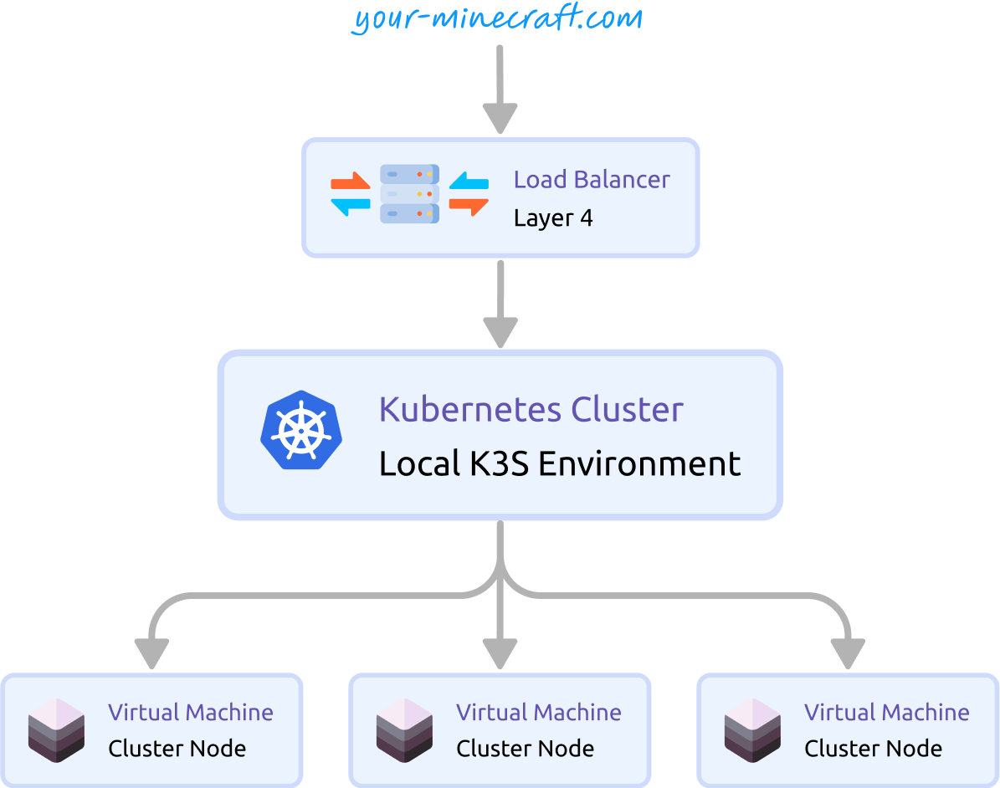

## Introduction

In this multi-part series, we will delve into the intricacies of deploying multiple Minecraft servers using Kubernetes.

We will also address the complexities of managing Minecraft servers at scale in a production environment and provide strategies to mitigate these challenges.

## What we're going to build

- A minimal Kubernetes cluster.
- A Docker image for a Minecraft server.
- Kubernetes Statefulset to manage our containerized Minecraft servers.
- Kubernetes Services to expose our Statefulset to external networks.
- Kubernetes Ingresses to route traffic to our Services.
- Kubernetes Persistent Volume Claims to ensure data persistence for our Minecraft servers.

## The high-level picture

Let's begin with a high-level architecture diagram of the setup we aim to create:

